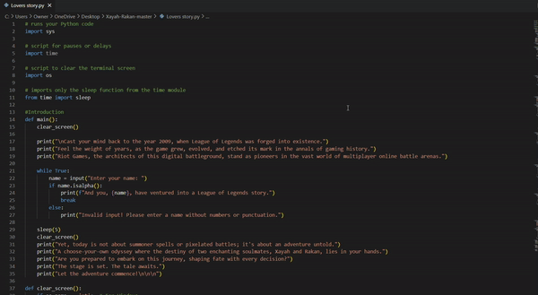

# Lover's Story
Welcome to the Lover's Story game, a text-based adventure set in the League of Legends universe.
### Description
In this interactive story, you play as Xayah, a brave adventurer seeking to rescue her soulmate, Rakan, from the clutches of human captors. Navigate through choices and shape the destiny of this enchanting couple.

### Steps to Run
Make sure you have Python installed on your system.

1. Download the lovers_story.py file from this repository.

1. Open a terminal or command prompt and navigate to the directory where the file is saved.

1. Run the following command to start the game:

1. python lovers_story.py

1. Follow the instructions provided in the game to make choices by entering the corresponding numbers.

1. Based on your choices, the game will progress, and different outcomes will be presented.

1. After the game ends, restart program to try again.

## Code Visual Before
 
 ---
 ## Code Visual After
 
 ---
 ## How to create a choose your own adventure story
1. Define the Setting:
    - Describe the setting in which your narrative is set. This could be a modern day setting, a sci-fi universe, or a fantasy world.
1. Create Characters:
    - Create characters with unique goals, personalities, and histories. Think about the main character or characters.
1. Describe the Storyline:
    - Create a basic storyline that outlines the major character arc and important moments. Point out places where the reader can make decisions that will affect the story's course.
1. Points of Decision in Design:
    - Identify the points in the narrative where the reader is forced to make a decision. Every decision should have a distinct result or implication.
1. Create Consequences:
    - Describe the effects of each decision. These repercussions could be anything from little storyline adjustments to big, game-altering discoveries.
1. Branching Paths:
    - Make sure the decisions taken have a logical branching effect on the tale. Consider the ways in which the reader's choices will cause the story to converge and diverge.
1. Maintain Variable Tracking:
    - Keep consistency and update any variables or aspects that your story tracks (such as character stats or inventory) as the plot develops.
1. Test Your Story:
    - Try reading the CYOA story aloud to someone else or yourself to see any errors in logic, story points, or decision-making. Make sure every path makes sense and is interesting.
1. Edit and polish:
    - Adjust your narrative in light of comments. To improve the reading experience overall, make adjustments to the pacing, vocabulary, and selections.

